# Page content

# Adding & Changing Page Content
`html`
```html
<!DOCTYPE html>
<html lang="en">
<head>
    <title>Document</title>
</head>
<body>
    <h1 id="page-title">The DOM</h1>
    <div>
        <p>hello, world</p>
        <p>lorem ipsum</p>
        <p class="error">this is an error message</p>
    </div>
    <div class="content">
        <p>this is the content</p>
    </div>
    <script src="sandbox.js"></script>
</body>
</html>
```

```js
const para = document.querySelector('p');
console.log(para.innerText);
//output:
hello, world
```


`changing Page content`
```js
// changing Page content
const para = document.querySelector('p');
para.innerText = 'ninjas are awesome!'
```
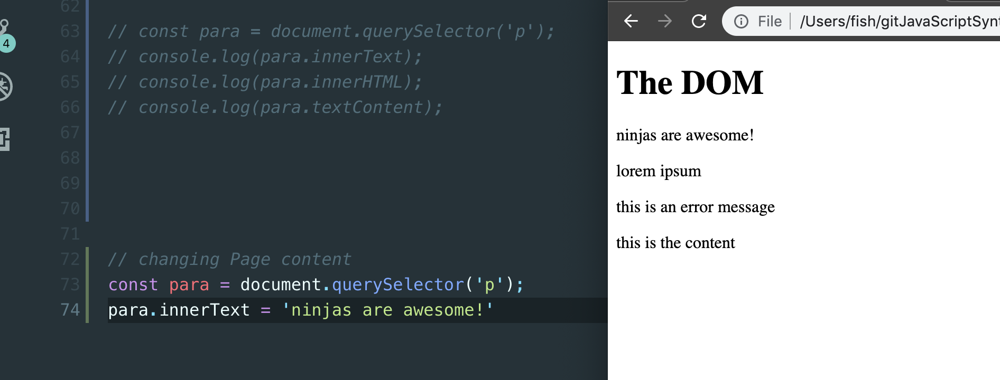


```js
const paras = document.querySelectorAll('p');
paras.forEach(element => {
    console.log(element.innerText);
})

//outptu:
hello, world
lorem ipsum
this is an error message
this is the content


const paras = document.querySelectorAll('p');
paras.forEach(element => {
    console.log(element.innerText);
    element.innerText = 'has been changed ...';
})
```
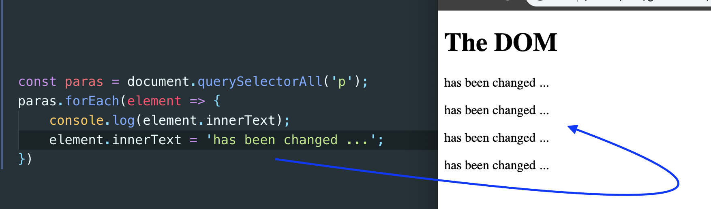


```js
const content = document.querySelector('.content');
console.log(content.innerHTML);
console.log(content.innerText);


//output:
<p>this is the content</p>
this is the content


const content = document.querySelector('.content');
content.innerHTML = '<h2>This is a new H2</h2>';
```
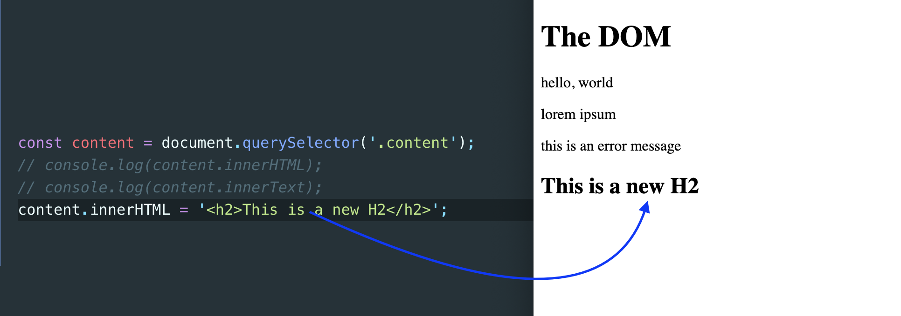


```js
const content = document.querySelector('.content');
const people = ['mario', 'luigi', 'yoshi'];
people.forEach(person => {
    content.innerHTML += `<p>${person}</p>`;
});
```
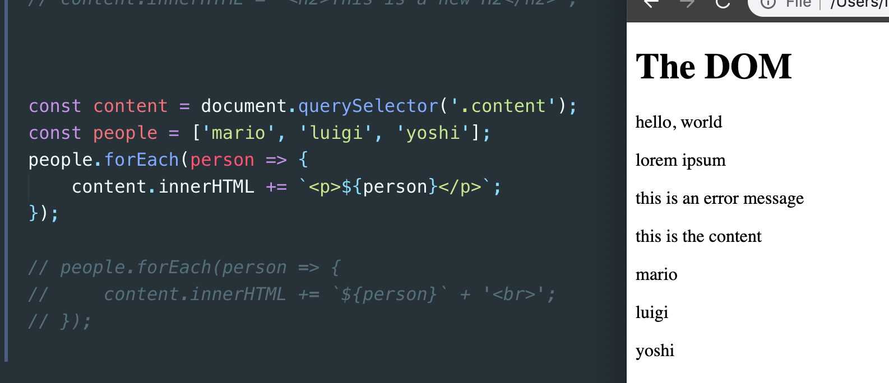


```js
const content = document.querySelector('.content');
const people = ['mario', 'luigi', 'yoshi'];
people.forEach(person => {
    content.innerHTML += `${person}` + '<br>';
});
```
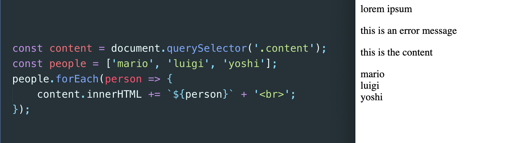


# Getting & Setting Attributes

`html`
```html
<!DOCTYPE html>
<head>
    <title>Document</title>
</head>

<body>
    <h1 id="page-title">The DOM</h1>
    <a href="http://www.google.com">Link to somewhere cool...</a>
    <p class="error">this is an error message</p>
    <script src="sandbox.js"></script>
</body>
</html>
```

`getAttribute()`
```js
const link = document.querySelector('a');
console.log(link.getAttribute('href'))
//output:
http://www.google.com
```

`setting`
```js
const link = document.querySelector('a');
console.log(link.getAttribute('href'));
link.setAttribute('href', 'http://www.apple.com');
```
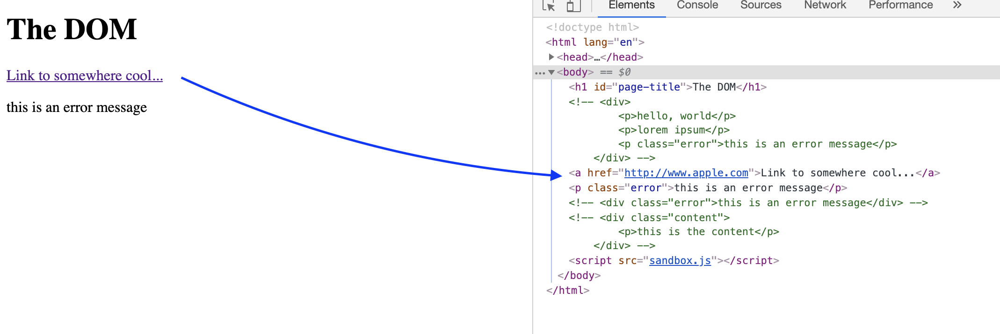


```js
const link = document.querySelector('a');
console.log(link.getAttribute('href'));
link.setAttribute('href', 'http://www.apple.com');
link.innerText = 'vscode';
const msg = document.querySelector('p');
console.log(msg.getAttribute('class'));  // error
```
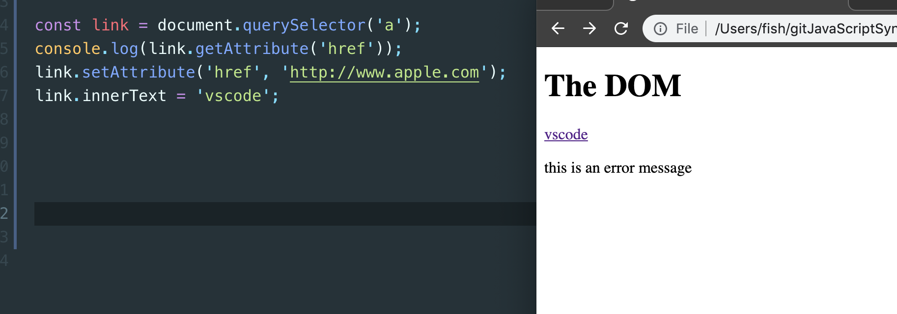

`msg.setAttribute('class', 'success');`
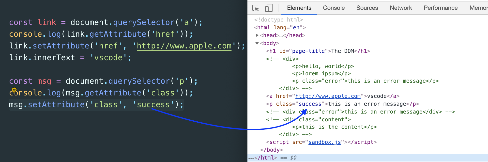


`msg.setAttribute('style', 'color:green');`
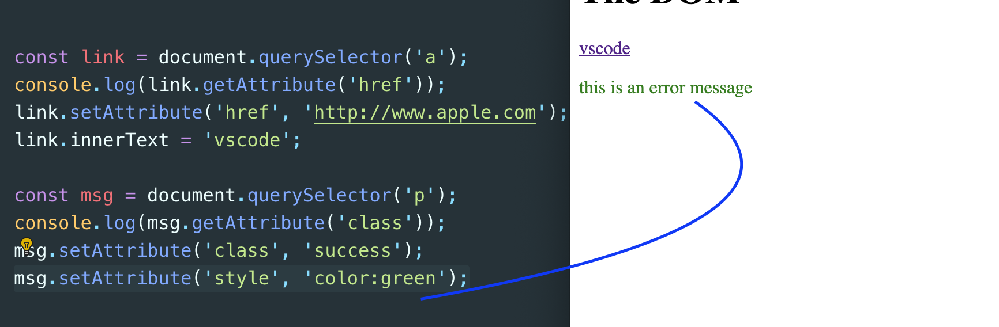


# Changing CSS Style

`html`
```html
<!DOCTYPE html>
<head>
    <title>Document</title>
</head>
<body>
    <h1 style="color: orange;">The DOM</h1>

    <script src="sandbox.js"></script>
</body>
</html>
```

```js
const title = document.querySelector('h1');
console.log(title.style);
console.log(title.style.color);

title.style.margin = '50px';
title.style.color = 'purple';
title.style.fontSize = '60px';
//title.style.margin = '';   //remove margin
```
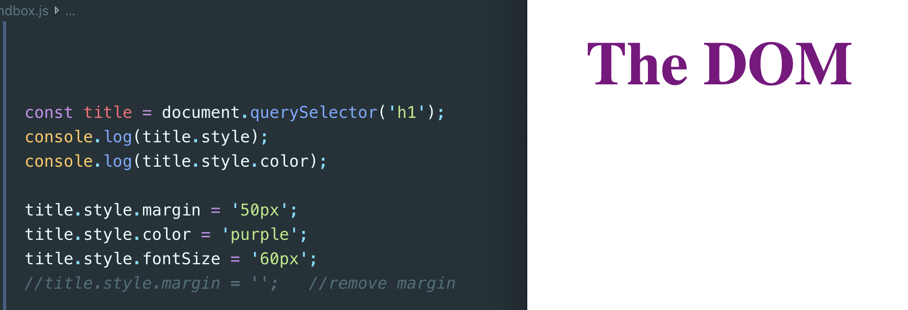


# Adding & Removing Classes

`html`
```html
<!DOCTYPE html>
<head>
    <title>Document</title>
</head>
<body>
    <h1>The DOM</h1>

    <p class="error">
        Lorem ipsum dolor sit amet consectetur adipisicing elit. Vel maiores repudiandae atque sint aliquam aspernatur sit debitis tempore modi exercitationem, voluptate ducimus voluptas aliquid dolore quae? Quo velit ea atque?
    </p>

    <script src="sandbox.js"></script>
</body>
</html>
```

`CSS`
```css
.error{
    padding: 10px;
    color: crimson;
    border: 1px dotted crimson;
}
.success{
    padding: 10px;
    color: limegreen;
    border: 1px dotted limegreen;
}
```

```js
const content = document.querySelector('p');
console.log(content.classList);
//output:
DOMTokenList ["error", value: "error"]
0: "error"
length: 1
value: "error"
__proto__: DOMTokenList
```

- **Important: adding two values into class** 
```html
    <p class="error another test">
        Lorem ipsum dolor sit amet consectetur adipisicing elit. Vel maiores repudiandae atque sint aliquam aspernatur sit debitis tempore modi exercitationem, voluptate ducimus voluptas aliquid dolore quae? Quo velit ea atque?
    </p>
```
```js
const content = document.querySelector('p');
console.log(content.classList);

//output:
DOMTokenList(3) ["error", "another", "test", value: "error another test"]
0: "error"
1: "another"
2: "test"
length: 3
value: "error another test"
__proto__: DOMTokenList
```

```js
const content = document.querySelector('p');
console.log(content.classList);
content.classList.add('error');
content.classList.remove('error');
content.classList.add('success');
```
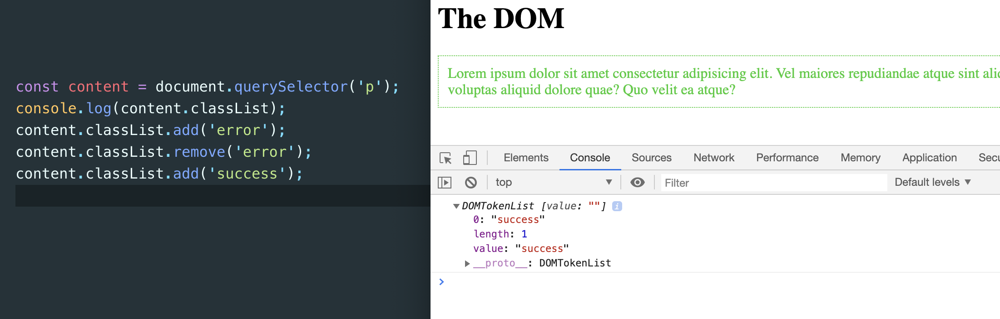

```js
const paras = document.querySelectorAll('p');
paras.forEach(p => {
    if (p.textContent.includes('error')) {
        p.classList.add('error');
    }
});
```
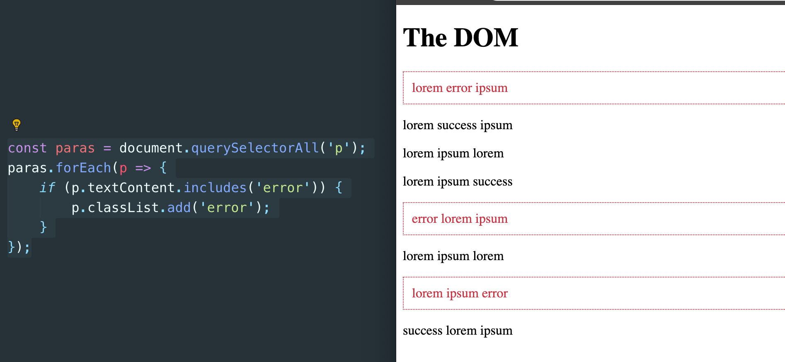


```js
const paras = document.querySelectorAll('p');
paras.forEach(p => {
    if (p.innerText.includes('success')) {
        p.classList.add('success');
    }
});
```
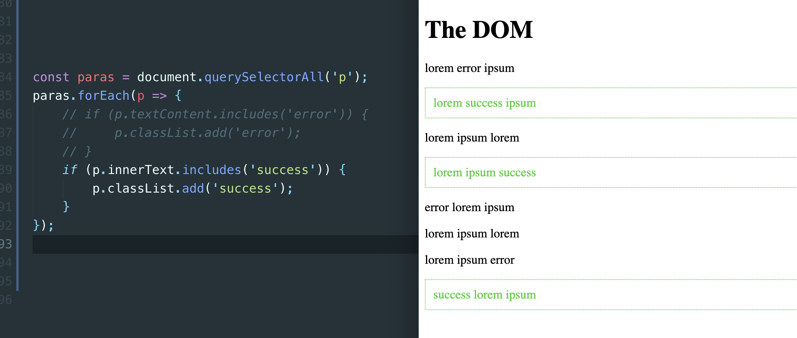


- updating html
`<h1 class="title">The DOM</h1>`

```js
const title = document.querySelector('.title');
title.classList.toggle('test');
title.classList.toggle('test');
```


# Parents, Children & Siblings

`html`
```html
<!DOCTYPE html>
<head>
    <link rel="stylesheet" href="style.css">
    <title>JavaScript</title>
</head>
<body>
    <h1>The DOM</h1>

    <article>
        <h2>article title</h2>
        <p>Lorem ipsum dolor sit amet consectetur, adipisicing elit.</p>
        <p>Lorem ipsum dolor sit amet consectetur, adipisicing elit.</p>
        <p>Lorem ipsum dolor sit amet consectetur, adipisicing elit.</p>
        <div>written by the net ninja</div>
    </article>
    <script src="sandbox.js"></script>
</body>
</html>
```


```js
const article = document.querySelector('article');
console.log(article.children);

//output:
HTMLCollection(5) [h2, p, p, p, div]
0: h2
1: p
2: p
3: p
4: div
```


- **Important: we can't use forEach on an HTML collection;we can use for each on a node list when we use the querySELECTall and we can also use a forEach on an array.**

- **So, what we could do is to take this collection and convert it into an array.**

- we can use **Array.form()**
  
```js
const article = document.querySelector('article');
console.log(article.children);
console.log(Array.from(article.children))

//output:
HTMLCollection(5) [h2, p, p, p, div]
(5) [h2, p, p, p, div]


const article = document.querySelector('article');
Array.from(article.children).forEach((child) => {
    child.classList.add('article-element');
});
```
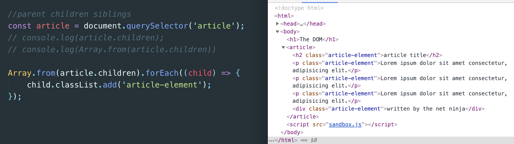


- find its parentNode
```js
const article = document.querySelector('article');
const title = document.querySelector('h2');
console.log(title.parentElement);

//output:
<article>...</article>


console.log(title.parentElement.parentElement);
//output:
<body>...</body>
```


- find nextElementSibling
`console.log(title.nextElementSibling);`


- find previousElementSibling
```js
console.log(title.previousElementSibling);

//output: null      since there is no previous sibling
```

- but if we add a previous sibling element
```html
    <p>previous sibling</p>
    <h2>article title</h2>
    <p>Lorem ipsum dolor sit amet consectetur, adipis
```
```js
console.log(title.previousElementSibling);

//output: <p>...</p>
```


# Event Basics (click event)

`html`
```html
<!DOCTYPE html>
<head>
    <title>JavaScript</title>
    <style>
        li {
            list-style-type: none;
            max-width: 200px;
            padding: 8px;
            margin: 8px auto;
            background: #eee;
            border: 1px dotted #ddd;
        }
    </style>
</head>
<body>
    <h1>Todos</h1>
    <ul>
        <li>buy milk</li>
        <li>read a book</li>
        <li>play the guitar</li>
        <li>pay the bills :(</li>
    </ul>
    <button>click me</button>
    <script src="sandbox.js"></script>
</body>
</html>
```

```js
//click event
const button = document.querySelector('button');
button.addEventListener('click', () => {
    console.log('click me!');
});

//output: click me!


const items = document.querySelectorAll('li');
items.forEach(item => {
    item.addEventListener('click', () => {
        console.log('item clicked');
    })
})

//output: item clicked
```


# delete
- **when an event occurs in the browser like a click event inside this callback function the browser automatically gives us a parameter called E or events you can call it what you want but it is an event object**
```js
const items = document.querySelectorAll('li');
items.forEach(item => {
    item.addEventListener('click', (e) => {
        console.log(e); 
    })
})
```
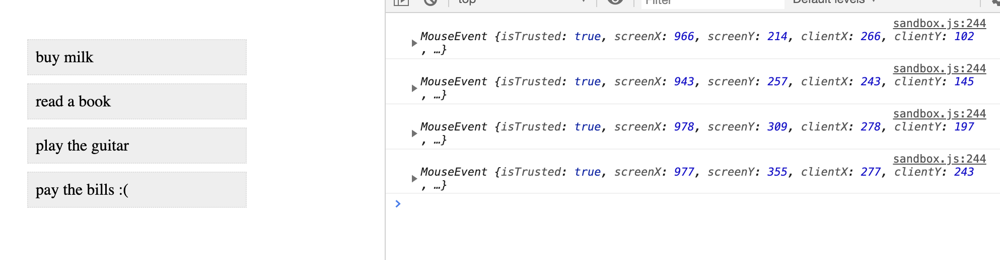

`e.target`
```js
const items = document.querySelectorAll('li');
items.forEach(item => {
    item.addEventListener('click', (e) => {
        console.log(e.target);
    })
})
```
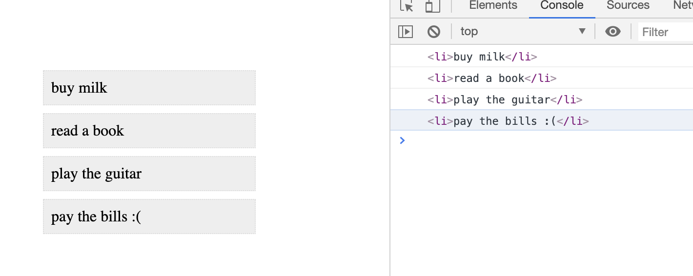

- also console.log(item) can get the same result
`console.log(item);`


- css **textDecoration**
```js
const items = document.querySelectorAll('li');
items.forEach(item => {
    item.addEventListener('click', (e) => {
        e.target.style.textDecoration = 'line-through';
    })
})
```
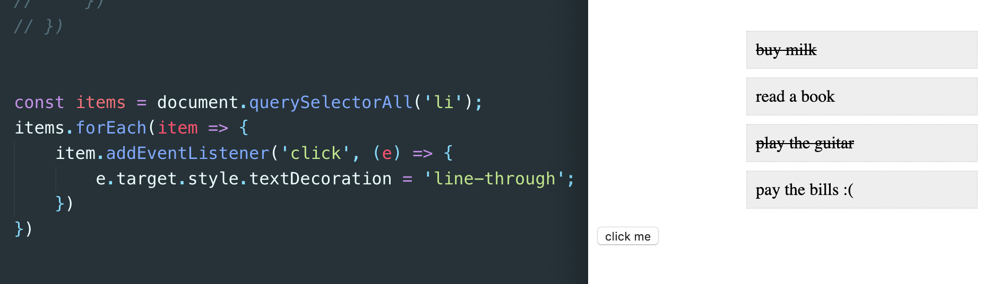


# Creating & Removing Elements

```js
const ul = document.querySelector('ul');
ul.remove();
```

```js
const ul = document.querySelector('ul');
const items = document.querySelectorAll('li');
items.forEach(item => {
    item.addEventListener('click', (e) => {
        e.target.remove();
    })
})
```


```js
const ul = document.querySelector('ul');
const button = document.querySelector('button');
button.addEventListener('click', () => {
    ul.innerHTML += '<li>something new</li>';
});

const items = document.querySelectorAll('li');
items.forEach(item => {
    item.addEventListener('click', (e) => {
        // e.target.style.textDecoration = 'line-through';
        e.target.remove();
    })
})
```
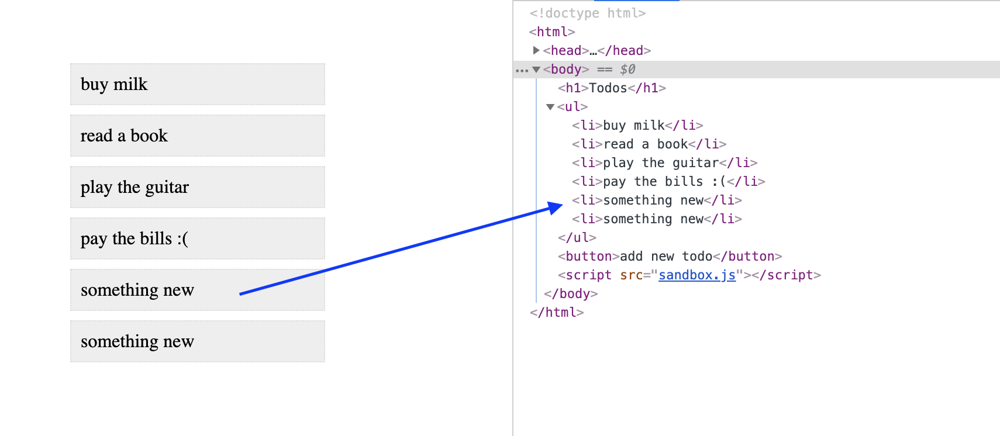


- **ul.append('li')**
```js
const ul = document.querySelector('ul');
const button = document.querySelector('button');
button.addEventListener('click', () => {
    const li = document.createElement('li');
    li.textContent = 'something new to do';
    ul.append(li);
});

const items = document.querySelectorAll('li');
items.forEach(item => {
    item.addEventListener('click', (e) => {
        // e.target.style.textDecoration = 'line-through';
        e.target.remove();
    })
})
```


- **ul.prepend('li')**
```js
const ul = document.querySelector('ul');
const button = document.querySelector('button');
button.addEventListener('click', () => {
    const li = document.createElement('li');
    li.textContent = 'something new to do';
    ul.prepend(li);
});

const items = document.querySelectorAll('li');
items.forEach(item => {
    item.addEventListener('click', (e) => {
        // e.target.style.textDecoration = 'line-through';
        e.target.remove();
    })
})
```


# Event Bubbling (and delegation)
```js
const ul = document.querySelector('ul');
const button = document.querySelector('button');
button.addEventListener('click', () => {
    const li = document.createElement('li');
    li.textContent = 'something new to do';
    // ul.append(li);
    ul.prepend(li);
});

const items = document.querySelectorAll('li');
items.forEach(item => {
    item.addEventListener('click', (e) => {
        console.log('event in LI');     
        e.target.remove();
    })
})

ul.addEventListener('click', e => {
    console.log('event in UL');
});
```
- **when click li, the fired event will be bubling up to its parent, thus, it will be propagating to UL node**
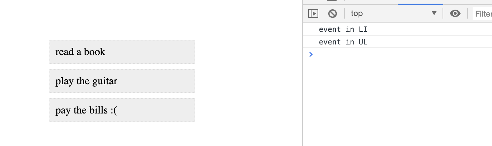

- **However, we can stop propagating by using function e.propagation()**
```js
const items = document.querySelectorAll('li');
items.forEach(item => {
    item.addEventListener('click', (e) => {
        console.log('event in LI');
        e.stopPropagation();
        e.target.remove();
    })
})

ul.addEventListener('click', e => {
    console.log('event in UL');
});
```
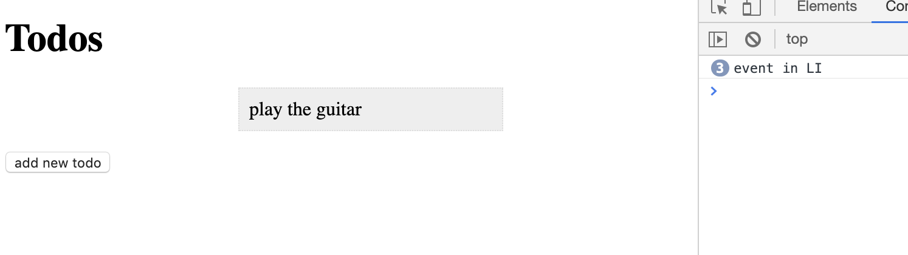


- **Since the event is goint to bubble up to the UL, we have an event listener attached to the UL, so this callback function is going to fire for that UL**
`updating`
```js
const ul = document.querySelector('ul');
const button = document.querySelector('button');
button.addEventListener('click', () => {
    const li = document.createElement('li');
    li.textContent = 'something new to do';
    // ul.append(li);
    ul.prepend(li);
});

ul.addEventListener('click', e => {
    console.log(e.target);
});
```


- But now, **we can delete the original li element, we can't delete new added li element:**

- using event delegation
```js
const ul = document.querySelector('ul');
const button = document.querySelector('button');
button.addEventListener('click', () => {
    const li = document.createElement('li');
    li.textContent = 'something new to do';
    ul.prepend(li);
});

ul.addEventListener('click', e => {
    if (e.target.tagName === 'LI') {
        e.target.remove();
    }
});
```


