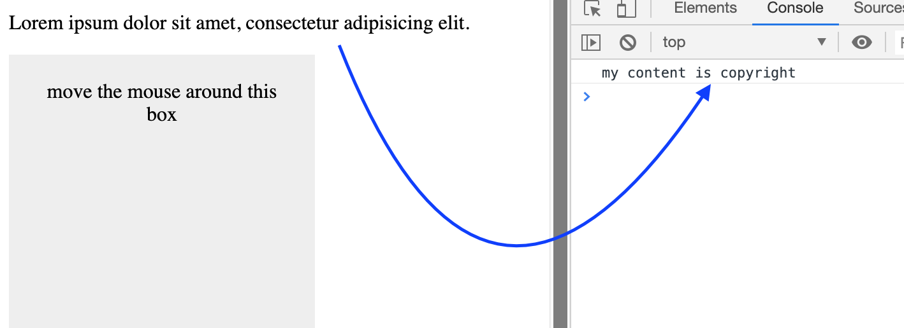

# More DOM event

`copy event`

```js
const copy = document.querySelector('.copy-me');
copy.addEventListener('copy', () => {
    console.log('my content is copyright');
});
```


`mousemove event, e.offsetX; e.offsetY`

```js
const box = document.querySelector('.box');
box.addEventListener('mousemove', e => {
    //console.log(e);
    console.log(e.offsetX, e.offsetY);
})
```


```js
const box = document.querySelector('.box');
box.addEventListener('mousemove', e => {
    box.textContent = `x pos - ${e.offsetX} y pos - ${e.offsetY}`;
})
```


`mouse wheel event`

```js
document.addEventListener('wheel', e => {
    console.log(e.pageX, e.pageY)
})
```


