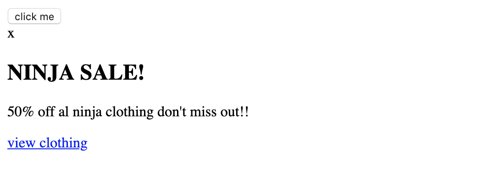

# Building a Popup (弹出窗口)

`adding html`

```html
<!DOCTYPE html>
<head>
    <link rel="stylesheet" href="styles.css">
    <title>Document</title>
</head>
<body>
    <button>click me</button>

    <div class="popup-wrapper">

        <div class="popup">
            <div class="popup-close">x</div>
            <div class="popup-content">
                <h2>NINJA SALE!</h2>
                <p>50% off al ninja clothing don't miss out!!</p>
                <a href="#">view clothing</a>
            </div>
        </div>
    </div>
    <script src="sandbox.js"></script>
</body>
</html>
```


`CSS`
```css
button{
    display: block;
    margin: 20px auto;
    background: crimson;
    color: white;
    border: 0;
    padding: 6px;
}
```


`CSS`
```css
.popup-wrapper{
    background: rgba(0, 0, 0, 0.5);
    position: fixed;
    top: 0;
    left: 0;
    width: 100%;
    height: 100%;
}
```


`CSS`
```css
.popup{
    font-family: arial;
    text-align: center;
    width: 100%;
    max-width: 300px;
    margin: 10% auto;
    padding: 20px;
    background: white;
    position: relative;
}
```


`CSS`
```css
.popup a{
    background:crimson;
    color: white;
    text-decoration: none;
    padding: 6px 10px;
}
```


`CSS`
```css
.popup-close{
    position: absolute;
    top:5px;
    right: 8px;
    cursor: pointer;
}
```


- Note: **if we set .css -> .popup-wrapper -> display:none** 
```css
.popup-wrapper{
    background: rgba(0, 0, 0, 0.5);
    position: fixed;
    top: 0;
    left: 0;
    width: 100%;
    height: 100%;
    display:none; /* it will display nothing */
}
```


- now we just need to hook up the javascript functionality by 
default we don't want any of this pop up to show on the page
```js
const button = document.querySelector('button');
const popup = document.querySelector('.popup-wrapper')

button.addEventListener('click', () => {
    popup.style.display = 'block';
})
```


`pop up & close`
```js
const button = document.querySelector('button');
const popup = document.querySelector('.popup-wrapper')
const close = document.querySelector('.popup-close')

button.addEventListener('click', () => {
    popup.style.display = 'block';
})

close.addEventListener('click', () => {
    popup.style.display = 'none';
})
```


`this time, we hope can click everywhere to close`
```js
const button = document.querySelector('button');
const popup = document.querySelector('.popup-wrapper')
const close = document.querySelector('.popup-close')

button.addEventListener('click', () => {
    popup.style.display = 'block';
})

close.addEventListener('click', () => {
    popup.style.display = 'none';
})

popup.addEventListener('click', () => {
    popup.style.display = 'none';
})
```
