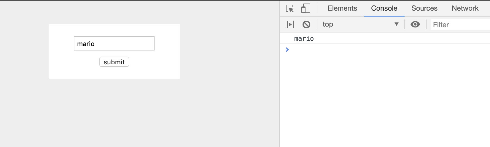
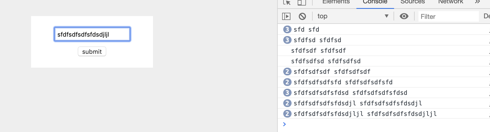

# Form

`html`
```html
<!DOCTYPE html>
<head>
    <title>JavaScript</title>
    <style>
        body{
            background: #eee;
        }
        form{
            max-width: 200px;
            margin: 40px auto;
            background: white;
            padding: 10px;
        }
        input{
            display: block;
            margin: 10px auto;
            padding: 4px;
        }
    </style>
</head>
<body>
    <form class="signup-form">
        <input type="text" id="username" placeholder="username">
        <input type="submit" value="submit">
    </form>

    <script src="sandbox.js"></script>
</body>
</html>
```

`e.preventDefault();`
```js
const form = document.querySelector('.signup-form');
form.addEventListener('submit', e => {
    e.preventDefault();
});
```
- **the default aciton of this event of the submit event is to referesh the page.**
- but if we tried to submit now **no longer does it refresh the page so that we can come down here** and do something that we want to.
- get the data from the form field over here, so how do we do?
    `we need to get a reference to this field right here.`

        1. first way we already know is to uset the query selector
```js
const form = document.querySelector('.signup-form');
const username = document.querySelector('#username');

form.addEventListener('submit', e => {
    e.preventDefault();
    console.log(username.value);
});
```


        2. the 2nd way
```js
const form = document.querySelector('.signup-form');
form.addEventListener('submit', e => {
    e.preventDefault();
    console.log(form.username.value);
});
```


# Regular Expressions

- suppose an user won't type in a user name that does have special characters and spaces.
- We're going to be using matching patterns called regular expressions or rejects for short and we use these regular expressions in many different programming languages to do these kinds of checks like Python and PSP they're not unique to javaScript 

    `For example we could create a reqular expression pattern to match some kind of string that an user types into a form field`

    `Now we could say that the pattern must contain between six and eight characters and they must all be Lowercase letters From A to Z; or we could write out a pattern to match a string of any length, but it must contain only numbers from 0 to 9`

```js
const form = document.querySelector('.signup-form');
form.addEventListener('submit', e => {
    e.preventDefault();
    console.log(form.username.value);
});

const username = 'sun';
const pattern = /[a-z]{6,}/;
//in this case, we don't want an upper limit. We just want it to be at least six characters long.

let result = pattern.test(username);
//if it passes the test then it's going to return true if it doen't pass the test it return false
console.log(result);

//output: false
```

- if we change the length of this string
`const username = 'shaunp';`
`//output: true`


- chang to this 
`const username = '@jsshaunp343sf@';`
`//output: true`
`True, because we're looking for this pattern which is a word at least six characters long`

- Now remember the way we avoid this is by putting a dollar sign at the end to say that this word must be at the end of the stirng. And we put a ^ sign that starts to say that this word must also be at the start 
```js
const form = document.querySelector('.signup-form');

form.addEventListener('submit', e => {
    e.preventDefault();
    console.log(form.username.value);
});

const username = '@jsshaunp343sf@';
const pattern = /^[a-z]{6,}$/;
//in this case, we don't want an upper limit. We just want it to be at least six characters long.

let result = pattern.test(username);
//if it passes the test then it's going to return true if it doen't pass the test it return false
console.log(result);

//output: false
```


- search() function
```js
const form = document.querySelector('.signup-form');

form.addEventListener('submit', e => {
    e.preventDefault();
    console.log(form.username.value);
});

// const username = '@jsshaunp343sf@';
const username = 'jsshaunp123';
const pattern = /^[a-z]{6,}$/;
//in this case, we don't want an upper limit. We just want it to be at least six characters long.

let result = username.search(pattern);
console.log(result)

//output: -1
```
`-1, means this it doesn't match since the $ at the end tell the username must be at the end of string`

```js
const username = 'jsshaunp';
const pattern = /^[a-z]{6,}$/;

let result = username.search(pattern);
console.log(result)

//output: 0
```
`So the match is at the position 0 and its position 0 because this is where the match is the first letter javascript is zero based. It's a bit like array notation the position of the match is the first position in the string`


- if we remove ^ $ 
```js
const form = document.querySelector('.signup-form');

form.addEventListener('submit', e => {
    e.preventDefault();
    console.log(form.username.value);
});

const username = '3434jsshaunp1234';
const pattern = /[a-z]{6,}/;

let result = username.search(pattern);
console.log(result)

//output: 4
```
`we still get a match, this thing down here is going to return its position it finds that match. This is the first letter of the word that matches.`


# Basic Form Validation
`updating html adding a div class="feedback"`

```html
<!DOCTYPE html>
<head>
    <title>JavaScript</title>
    <style>
        body{
            background: #eee;
        }
        form{
            max-width: 200px;
            margin: 40px auto;
            background: white;
            padding: 10px;
        }
        input{
            display: block;
            margin: 10px auto;
            padding: 4px;
        }
    </style>
</head>
<body>
    <form class="signup-form">
        <input type="text" id="username" placeholder="username">
        <input type="submit" value="submit">
        <div class="feedback"></div>
    </form>

    <script src="sandbox.js"></script>
</body>
</html>
```

`.js`
```js
//Basic Form Validation
const form = document.querySelector('.signup-form');
const feedback = document.querySelector('.feedback');

form.addEventListener('submit', e => {
    e.preventDefault();
    //validation
    const username = form.username.value;
    const usernamePattern = /^[a-zA-Z]{6,12}$/;

    if (usernamePattern.test(username)) {
        //feedback good info
        feedback.textContent = 'that username is valid!';
    } else {
        //feedback help info
        feedback.textContent = 'username must contain letters & only be between 6 and 12 characters long';
    }
});
```


# Keyboard Event

`js`

```js
//keyboard Event
const form = document.querySelector('.signup-form');
const feedback = document.querySelector('.feedback');

//live feedback
form.username.addEventListener('keyup', e => {
    console.log(e.target.value, form.username.value);
})
```

- now we can see:
`e.target.value `  **is the same as**  ` form.username.value`


`Now, updating the html's css style`
```html
<!DOCTYPE html>
<head>
    <title>JavaScript</title>
    <style>
        body{
            background: #eee;
        }
        form{
            max-width: 200px;
            margin: 40px auto;
            background: white;
            padding: 10px;
        }
        input{
            display: block;
            margin: 10px auto;
            padding: 4px;
        }
        .success{
            border: 2px solid limegreen;
        }
        .error{
            border: 2px solid crimson;
        }
    </style>
</head>
<body>
    <form class="signup-form">
        <input type="text" id="username" placeholder="username">
        <input type="submit" value="submit">
        <div class="feedback"></div>
    </form>

    <script src="sandbox.js"></script>
</body>
</html>
```
`so we have added .success .error style`


`updating js`
```js
const form = document.querySelector('.signup-form');
const feedback = document.querySelector('.feedback');
const usernamePattern = /^[a-zA-Z]{6,12}$/;

form.addEventListener('submit', e => {
    e.preventDefault();
    //validation
    const username = form.username.value;


    if (usernamePattern.test(username)) {
        //feedback good info
        feedback.textContent = 'that username is valid!';
    } else {
        //feedback help info
        feedback.textContent = 'username must contain letters & only be between 6 and 12 characters long';
    }
});

//live feedback
form.username.addEventListener('keyup', e => {
    if (usernamePattern.test(e.target.value)) {
        form.username.setAttribute('class', 'success');
    } else {
        form.username.setAttribute('class', 'error');
    }
})
```


