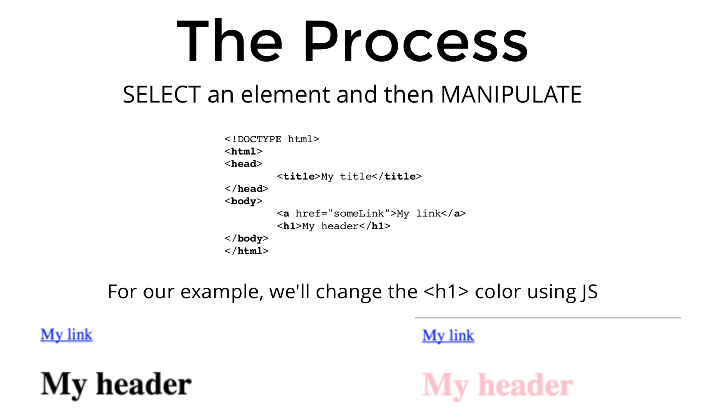
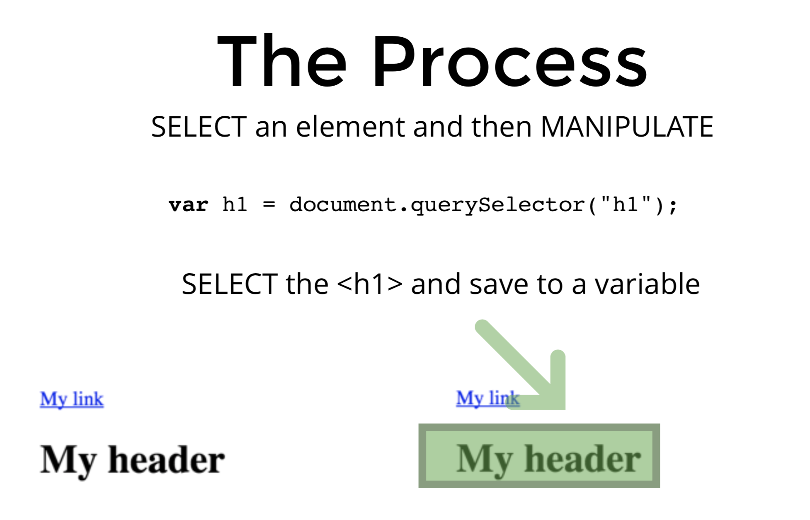
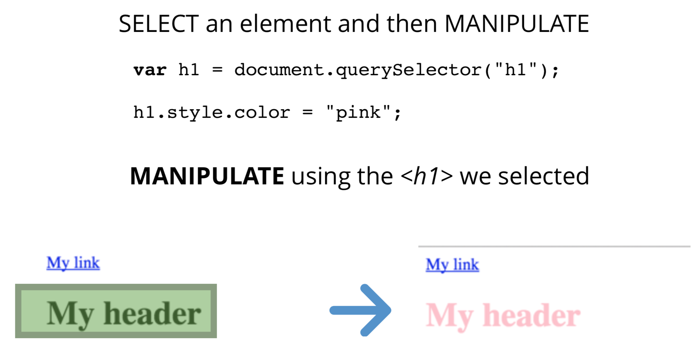
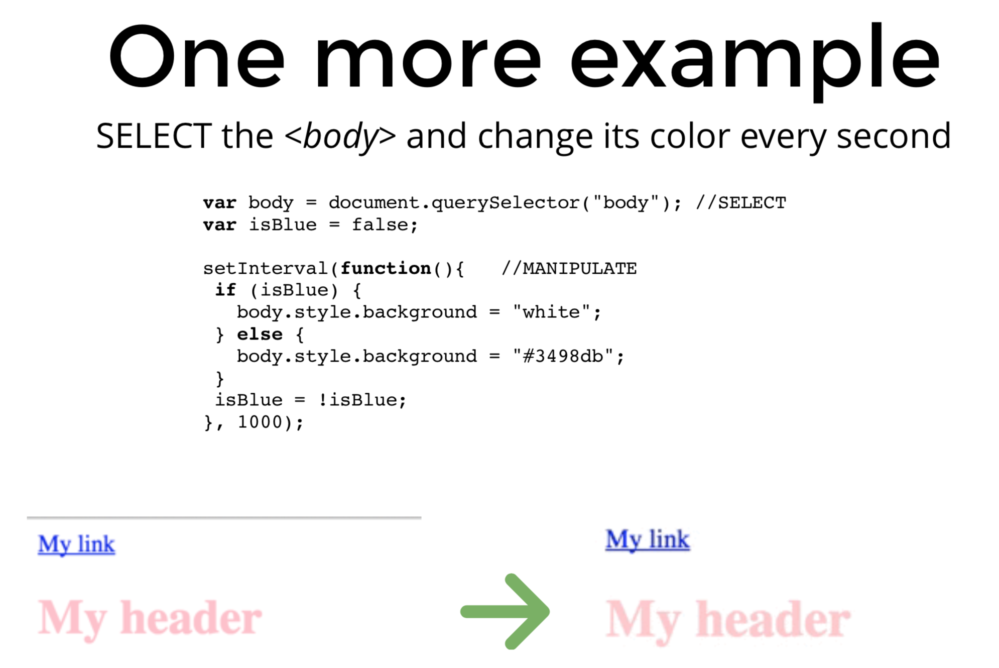

# Introduce to the DOM
`Finally, JS meets HTML + CSS`

# Why Should care?
`A few examples:`
- Games
- Scrolling Effects
- Dropdown menus
- Form Validations
- Interactivity
- Animations
- Every awesome site ever

# The DOM Document Object Model
- The Document Object Model is the interface between your javascript and HTML+CSS

- The browser turns every HTML **tag** into a javascript object that we can manipulate
- Everything is stored inside of the **document** object

- Document is the root node where everything else lives inside of


# The Process






`Example:`
```html
<!DOCTYPE html>
<head>
    <title>Document</title>
</head>
<body>
    <h1 id="page-title">The DOM</h1>

    <div>
        <p>hello, world</p>
        <p>lorem ipsum</p>
        <p class="error">this is an error message</p>
    </div>

    <div class="error">this is an error message</div>

    <script src="sandbox.js"></script>
</body>
</html>
```

`sandbox.js`
```js
const para = document.querySelector('div.error');
console.log(para);

/*  */
//output:
<div class="error">this is an error message</div>

/*  */
const para = document.querySelector('p.error');
//output:
<p class="error">this is an error message</p>


const para = document.querySelector('p');
console.log(para);
//output:
<p>hello, world</p>


/*  */
const para = document.querySelectorAll('p');
console.log(para);
//outpu:
NodeList(3) [p, p, p.error]
0: p
1: p
2: p.error
length: 3
__proto__: NodeList


const para = document.querySelectorAll('p');
console.log(para[2]);
//outpu:
 <p class="error">this is an error message</p>


const para = document.querySelectorAll('p');
para.forEach(para => {
    console.log(para);
});
//outpu:
        <p>hello, world</p>
        <p>lorem ipsum</p>
        <p class="error">this is an error message</p>


const errors = document.querySelectorAll('.error');
console.log(errors);
//output:
NodeList(2) [p.error, div.error]
0: p.error
1: div.error
length: 2
__proto__: NodeList


//get an element by ID
const title = document.getElementById('page-title');
console.log(title);
//output:
 <h1 id="page-title">The DOM</h1>


 // get element by their class name
const errors = document.getElementsByClassName('error');
console.log(errors);

//output
HTMLCollection(2) [p.error, div.error]
0: p.error
1: div.error
length: 2
__proto__: HTMLCollection

 <p class="error">this is an error message</p>


//get element by their tag name
const paras = document.getElementsByTagName('p');
console.log(paras)
console.log(paras[1])
//output
HTMLCollection(3) [p, p, p.error]
<p>lorem ipsum</p>


```

