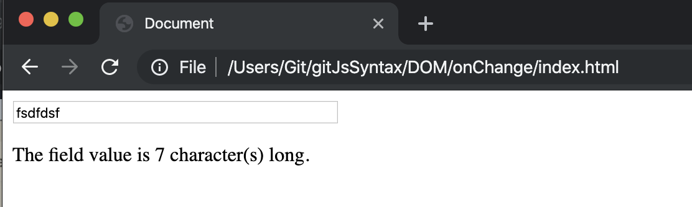

### create a index.html
```html
<!DOCTYPE html>
<html lang="en">
<head>
    <meta charset="UTF-8">
    <meta name="viewport" content="width=device-width, initial-scale=1.0">
    <meta http-equiv="X-UA-Compatible" content="ie=edge">
    <title>Document</title>
</head>
<body>
    <input type="text" placeholder="Type something here, then click outside of the field." size="50">
    <p id="log"></p>
    <script src="index.js"></script>
</body>
</html>
```
- create an index.js
```js
let input = document.querySelector('input');
let log = document.getElementById('log');

input.onchange = handleChange;

function handleChange(e) {
    log.textContent = `The field value is ${e.target.value.length} character(s) long.`;
}
```
