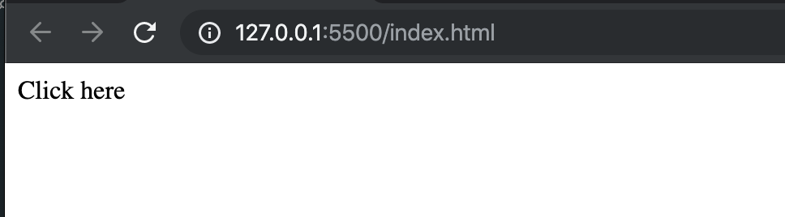
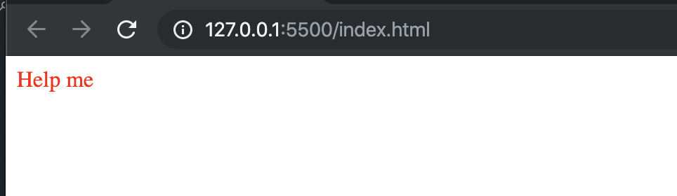

### create a index.html
```html
<!DOCTYPE html>
<html lang="en">
<head>
    <meta charset="UTF-8">
    <meta name="viewport" content="width=device-width, initial-scale=1.0">
    <meta http-equiv="X-UA-Compatible" content="ie=edge">
    <title>Document</title>
</head>
<body>
    <div id="demo">Click here</div>
    <script src="index.js"></script>
</body>
</html>
```
- create an index.js
```js
let demo = document.getElementById('demo');
demo.onclick = changeContent;
function changeContent(){
    demo.innerHTML = "Help me";
    demo.style = "Color:red";
}

```


