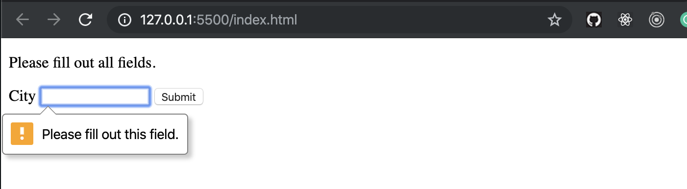
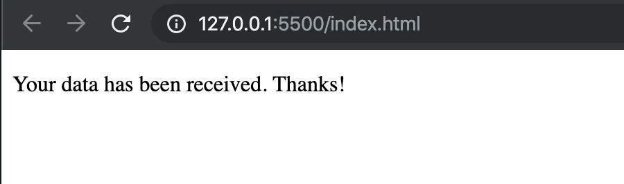

### create a index.html
```html
<body>
    <form id="form">
        <p id="error" hidden>Please fill out all fields.</p>
      
        <label for="city">City</label>
        <input type="text" id="city" required>
      
        <button type="submit">Submit</button>
    </form>
    <p id="thanks" hidden>Your data has been received. Thanks!</p>
    <script src="index.js"></script>
</body>
```
- create an index.js
```js
document.getElementById('city').oninvalid = (event) => {
    document.getElementById('error').removeAttribute('hidden');
}
```
- if you didn't input anything, id `city`'s oninvalid event fires, id `error`'s attribute `hidded` is removed, then you can see the message

- Note: `oninvalid` event,
- For example, the input field is invalid if the required attribute is set and the field is empty (the required attribute specifies that the input field must be filled out before submitting the form).
---
-
```js
document.getElementById('form').onsubmit = (event) => {
    document.getElementById('form').setAttribute('hidden', '');
    document.getElementById('thanks').removeAttribute('hidden');

    event.preventDefault();
}
```
- if you input the city, and click `enter` or click `submit`, then it is firing onsubmit event, `form`'s attribute is hidden; at the smae time, id `thanks`'s attribute `hidden` will be removed
